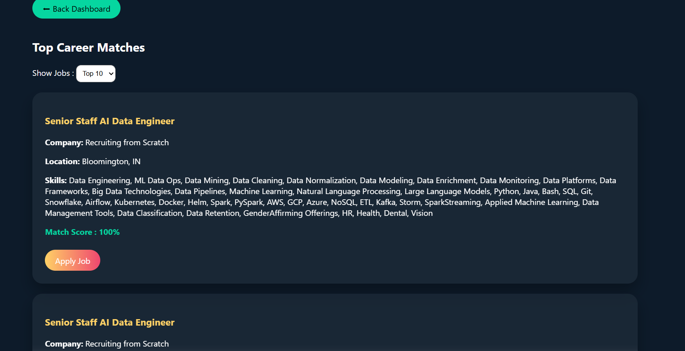
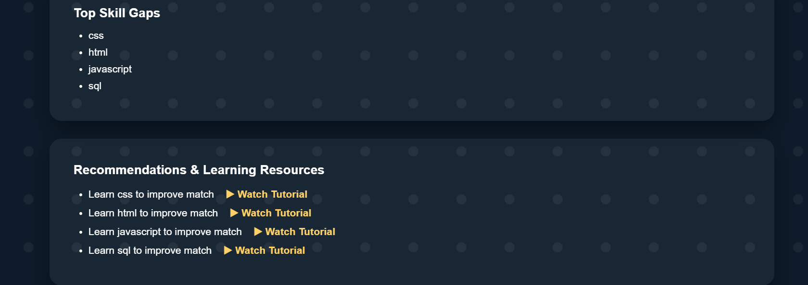
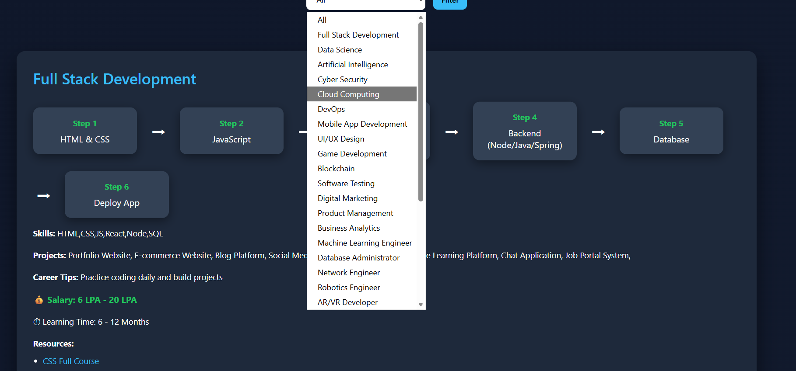
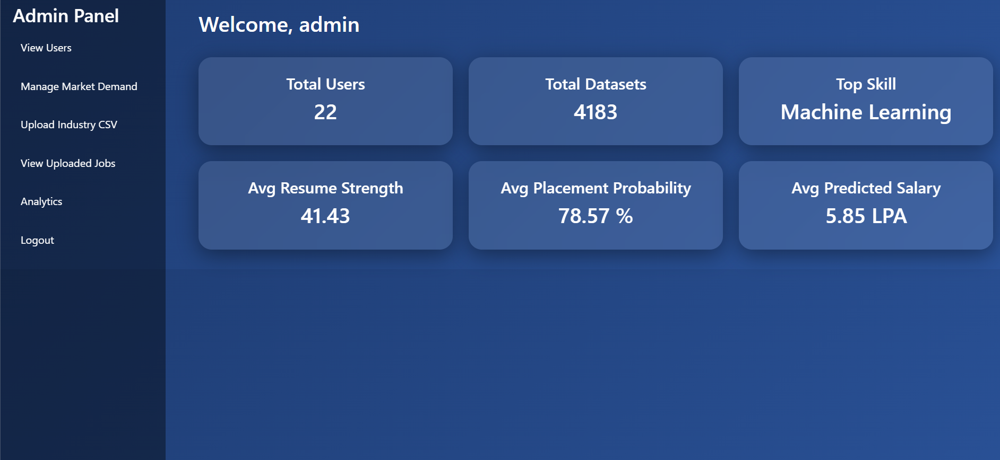

# 🚀 Big Data Career Guidance System

## 📌 Project Overview
A web-based application that helps users analyze their skills, identify career paths, and track learning progress in Big Data and related domains.

---

## 🎯 Key Features
- 👤 User Registration & Login System
- 📊 Skill Analysis & Skill Gap Detection
- 🎯 Career Matching based on skills
- 🛣️ Career Roadmaps (Step-by-step learning paths)
- 💼 Job Recommendations
- 📈 Expected Salary Insights
- 📚 Learning Resources Integration
- 🧭 Domain Selection (Data Science, Web Dev, AI, etc.)

---

## 🛠️ Technologies Used
- Java (JSP, Servlets)
- MySQL Database
- HTML, CSS, JavaScript
- Bootstrap
- Apache Tomcat Server
- NetBeans IDE

---

## 💡 How It Works
1. User registers and enters skills
2. System analyzes skill gap
3. Suggests suitable career domains
4. Displays roadmap and learning path
5. Shows job roles and salary expectations

---

## 🎓 Purpose
This project helps students and beginners:
- Understand industry requirements
- Improve skills
- Choose correct career path

---

## 👩‍💻 Author
**Sai Divya Matam**

---

## 🔗 Future Enhancements
- AI-based chatbot
- Resume analyzer
- Real-time job API integration

## 📸 Project Screenshots

### 🔐 Login Page

### 📝 Register Page

### 👤 User Dashboard

### 🎯 Career Match Page

### 📊 Skill Gap Analysis

### 💡 Recommendations

### 🛣️ Career Roadmaps

### 🛡️ Admin Login Page

